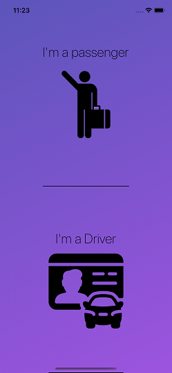
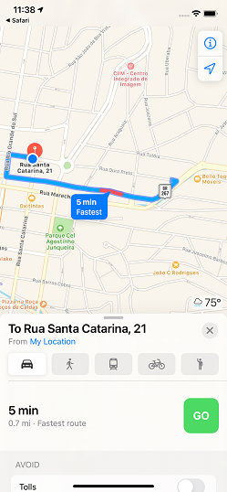

# my-uber-app-react-native




> ## A `Uber` type React-Native App that links Taxi Drivers and Passengers.


## Functionalities
* Sign up / Login / Authentication
* Passenger type a location on the search box and the app will determine and trace the route on the Google Map Api.
* Taxi Driver will receive Passenger's location and trace the route, choosing to accept the ride and going to Navigation
* If a Taxi Driver accept the ride, the Passenger receives a notification and Driver's background location to watch the trip.

## Techniques/framework
* React-native
* Express
* Socket.io
* Mongodb
* Google Maps Api

## Installation - yarn

### Installing

```bash
$ yarn
```
or
```bash
$ npm install
```

#### For IOS development

```bash
$ sudo gem install cocoapods

$ cd ios && pod install
```

#### For ANDROID develpment

Go to file:
`/node_modules/@mauron85/react-native-background-geolocation/android/common/gradle.properties`
And set:
```gradle
android.enableUnitTestBinaryResources=false
```
from terminal
```bash
$ npx jetify
```

## Running

#### Android
```bash
$ yarn android
```
#### iOS
```bash
$ yarn ios
```

---

&copy; 2021 `@gsecret054` All Rights Reserved.
